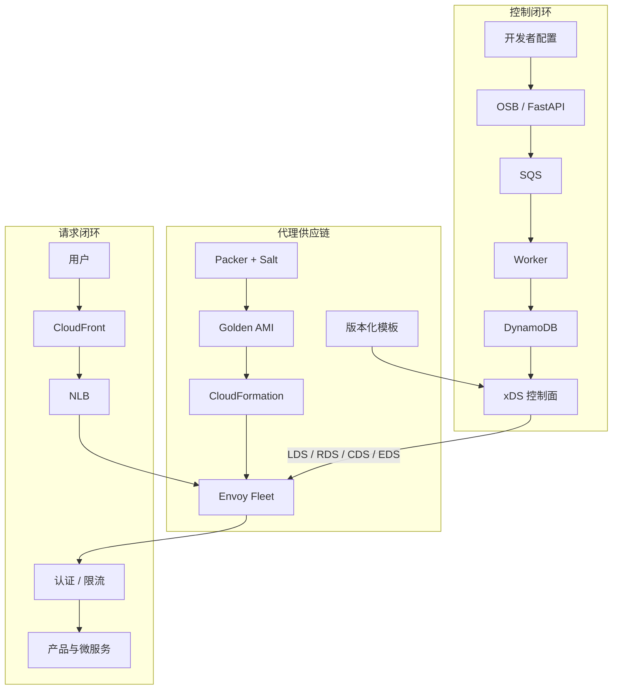
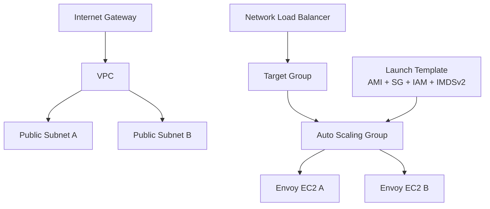

# Atlassian 边缘平台技术路线与 Lab 手册

版本：2026-08-28

适用对象：有 Python、Linux、HTTP 基础，希望进入平台工程、云基础设施、流量治理或 SRE 方向的开发者

建议周期：12 周，每周 8～12 小时

## 1. 这段视频真正讲了什么

视频不是 Atlassian 全站架构揭秘，而是一位工作约八年的工程师对自己参与建设的内部边缘/负载均衡平台的回顾。核心主线是：

1. 用 Open Service Broker（OSB）为内部开发团队提供自助式资源申请接口。
2. 用 FastAPI、SQS、Worker 和 DynamoDB 把耗时的资源创建改造成异步状态机。
3. 用 Envoy 替代昂贵的企业负载均衡设备，并以 xDS 控制面动态下发配置。
4. 用“模板 + 上下文”把 Envoy 的复杂配置封装成简单、受约束的开发者参数。
5. 用 CloudFormation 部署 VPC、子网、IAM、Security Group、Auto Scaling Group 和长生命周期代理集群。
6. 用 Packer 和 SaltStack 制作包含 Envoy、加固、网络调优、日志与可观测性代理的 AMI。
7. 把 Jira、Confluence、Bitbucket、Statuspage 等产品和大量微服务逐步迁移到统一边缘平台。
8. 通过 Envoy 原生过滤器和 sidecar，把认证、授权、限流、访问日志等共性能力前移到边缘。
9. 通过文档、培训、值班手册、故障演练和配置保护机制解决长期维护问题。
10. 在大型组织中用 RFC、说服、冲突解决和指导他人的能力推动平台落地。

视频章节与本路线的对应关系：

| 视频章节 | 时间 | 本路线模块 |
|---|---:|---|
| Interview process | 00:58 | Module 1：网络、微服务与故障诊断基础 |
| Building an Open Service Broker | 04:35 | Module 2：OSB API 与开发者自助服务 |
| Diagram of OSB architecture | 07:43 | Module 3：SQS、Worker、DynamoDB 异步编排 |
| Picking a proxy technology - Envoy | 09:56 | Module 4：Envoy 数据面 |
| Envoy XDS Control Plane | 11:36 | Module 5：xDS 控制面、模板与上下文 |
| AWS Infrastructure | 14:33 | Module 6：CloudFormation 与长生命周期代理集群 |
| Creating the machine image (AMI) | 17:45 | Module 7：Packer、SaltStack 与 Golden AMI |
| Extending the load balancing platform | 22:45 | Module 8：多租户、迁移与平台产品化 |
| Envoy extensions / Edge Compute | 24:37 / 25:54 | Module 9：认证、授权、限流、日志与 sidecar |
| Handling concerns for dev teams | 27:12 | Module 9、10：统一治理与可观测性 |
| Maintaining software over long-term | 32:14 | Module 10：可靠性、值班与长期维护 |
| Diplomacy / Personality / Mentoring | 31:35 / 35:42 / 37:11 | Module 11：平台领导力与指导能力 |

主要视频依据：

- [原视频及章节](https://www.youtube.com/watch?v=55pTFVoclvE)
- [可搜索的完整英文字幕](https://www.withtranscript.ai/video/55pTFVoclvE)

## 2. 架构总览



要把这张图真正学会，需要同时理解两个闭环：

- 控制闭环：开发者声明意图 → Broker 持久化期望状态 → 控制面生成版本化配置 → Envoy ACK/NACK → 状态可观测。
- 请求闭环：用户请求 → CDN/NLB → Envoy 过滤器链 → sidecar 决策 → 上游服务 → 访问日志、指标和追踪。

## 3. 学习成果与完成定义

完成全部路线后，你应能独立回答并演示：

- 为什么资源创建不能直接在同步 HTTP 请求里完成？如何实现幂等、重试和最终一致性？
- Listener、Route、Cluster、Endpoint 的关系是什么？一次 HTTP 请求如何通过 Envoy？
- xDS 的 LDS、RDS、CDS、EDS 分别负责什么？ACK/NACK、nonce、version_info 有何意义？
- 如何把“任意 Envoy YAML”收敛为安全、简单、可验证的开发者接口？
- 如何构建不可变 AMI，并用 Launch Template、ASG 和滚动替换发布？
- 多租户平台怎样避免一个团队把流量路由到另一个团队的 cluster？
- ext_authz、rate limit、access log 应 fail-open 还是 fail-closed？
- 怎样检测坏配置、快速回滚，并区分控制面故障和数据面故障？
- 新成员接手系统时需要哪些架构图、runbook、告警和演练？

最终 Capstone：本地运行一个 `broker + queue + worker + desired-state store + xDS control plane + Envoy + authz sidecar + backend + Prometheus` 的最小平台，并完成一次配置发布、一次 NACK、一次后端故障和一次回滚演练。

## 4. 成本与安全边界

默认 Lab 使用 Docker 和本地进程，不需要云账号。涉及 AWS 的命令分为三类：

- 免费/只读：`aws sts get-caller-identity`、`aws cloudformation validate-template`、本地 lint。
- 可能收费：Packer 构建 AMI、EC2、NLB、NAT Gateway、CloudFront、WAF、Route 53 Hosted Zone。
- 必须清理：CloudFormation Stack、Packer 临时实例、AMI、Snapshot、EIP、NAT Gateway。

不要在个人电脑或代码仓库中写入长期 AWS Access Key。优先使用 AWS IAM Identity Center/SSO：

```bash
aws configure sso --profile edge-lab
aws sso login --profile edge-lab
aws sts get-caller-identity --profile edge-lab
```

为所有实验资源加统一标签：

```text
Project=atlassian-edge-lab
Owner=your-name
ExpiresAt=2026-08-31
```

## Module 0：工作站与实验规范

### 目标

建立可重复的本地环境；所有 Lab 都有启动、验证、停止和清理命令。

### 推荐环境

- macOS 13+ 或 Ubuntu 22.04+
- 16 GB 内存，至少 20 GB 可用磁盘
- Docker Desktop/OrbStack/Colima 三选一
- Python 3.12+、Go 1.24+、Rust stable、AWS CLI v2、Packer 1.16+
- Envoy Lab 固定使用 `envoyproxy/envoy:v1.39.1`；升级前先阅读 release notes 并重新跑回归测试

Envoy 版本应锁定到经过测试的补丁版本。撰写本手册时最新主版本为 v1.39.1；官方发布页也列出仍受维护的 1.38、1.37、1.36、1.35 补丁线。不要在生产模板中使用 `latest`。

### macOS 安装

```bash
xcode-select --install
brew update
brew install git jq yq awscli go rustup packer shellcheck hadolint
brew install --cask docker
rustup default stable
```

启动 Docker Desktop 后验证：

```bash
docker version
docker compose version
python3 --version
go version
rustc --version
cargo --version
aws --version
packer version
```

Ubuntu 可使用 Docker 官方仓库安装 Docker Engine；Python、Go、Rust、Packer 应按各自官方安装说明完成，避免发行版仓库中的陈旧版本。

### 建立 Lab 目录和统一命令习惯

```bash
mkdir -p atlassian-edge-labs/{artifacts,logs,state}
cd atlassian-edge-labs
git init
printf '.venv/\n__pycache__/\n.env\n*.log\nartifacts/\nstate/\n' > .gitignore
```

每个 Lab 都必须支持：

```bash
docker compose config       # 静态检查
docker compose up -d        # 启动
docker compose ps           # 查看状态
docker compose logs --tail=100
docker compose down -v      # 清理本地容器和卷
```

### Lab 0：环境体检

1. 保存上述版本输出到 `artifacts/toolchain.txt`。
2. 运行一个一次性容器：

```bash
docker run --rm alpine:3.22 uname -a
docker run --rm envoyproxy/envoy:v1.39.1 --version
```

3. 验证本机 8000、9901、10000、4566、9090 端口没有冲突：

```bash
lsof -nP -iTCP:8000 -iTCP:9901 -iTCP:10000 -iTCP:4566 -iTCP:9090 -sTCP:LISTEN
```

验收标准：Docker 能拉取并运行 Envoy；工具版本已记录；没有把云密钥写进仓库。

## Module 1：系统基础、DNS 与故障诊断

### 为什么先学这个

视频中的面试覆盖了 Cloudflare 自定义域名、微服务、容器、真实事故排障和 Route 53 latency-based routing。这说明平台工程师首先需要从 HTTP、DNS、进程和网络的第一性原理定位问题。

### 必须掌握

- DNS 递归与权威解析、TTL、CNAME/ALIAS、基于地理或延迟的路由
- TCP 建连、TLS SNI/证书链、HTTP/1.1 与 HTTP/2
- 正向代理、反向代理、L4 与 L7 负载均衡
- 容器网络、端口映射、健康检查
- RED 指标：Rate、Errors、Duration；USE 指标：Utilization、Saturation、Errors
- 从“用户症状 → DNS → 边缘 → 代理 → 上游 → 依赖”的排障顺序

Route 53 的 latency-based routing 不是实时三角测量单个客户端延迟，而是基于 AWS 对来源与区域间延迟的测量选择记录。实际系统还要考虑 DNS 缓存、EDNS Client Subnet、健康检查和故障转移。

### 配置与命令

```bash
# DNS
dig www.atlassian.com A
dig www.atlassian.com CNAME
dig +trace www.atlassian.com

# TLS 与 SNI
openssl s_client -connect www.atlassian.com:443 \
  -servername www.atlassian.com -showcerts </dev/null

# HTTP 分阶段耗时
curl -sS -o /dev/null \
  -w 'dns=%{time_namelookup} connect=%{time_connect} tls=%{time_appconnect} ttfb=%{time_starttransfer} total=%{time_total}\n' \
  https://www.atlassian.com/

# 本地监听与连接
lsof -nP -iTCP -sTCP:LISTEN
```

### Lab 1：逐层定位“服务不可用”

1. 启动后端：

```bash
mkdir -p labs/01-troubleshooting/site
cd labs/01-troubleshooting/site
printf 'edge-lab-ok\n' > index.html
python3 -m http.server 8000
```

2. 在另一终端建立基线：

```bash
curl -v http://127.0.0.1:8000/
curl -sS -o /dev/null -w '%{http_code} %{time_total}\n' http://127.0.0.1:8000/
```

3. 依次制造并诊断：进程退出、错误端口、错误 Host、响应延迟、DNS 指向错误。
4. 每次只能先问五个问题：影响范围、最近变更、何时开始、哪一层首次异常、能否回滚。
5. 产出 `incident-notes.md`，包含时间线、证据、根因、恢复动作和预防动作。

验收标准：不能只说“网络有问题”，必须用命令指出失败发生在解析、连接、TLS、代理还是应用阶段。

## Module 2：Open Service Broker API 与自助服务

### 视频中的设计

Atlassian 内部开发者通过版本库中的配置声明需要公开服务。Broker 暴露 catalog、provision、update、deprovision、last_operation 等接口，把底层负载均衡、DNS、CloudFront 等资源抽象成 service 和 plan。

OSB API 的价值不是“再造一个 CRUD API”，而是稳定地分离：

- 平台：知道“想要什么”，不需要知道如何创建。
- Broker：管理生命周期、幂等、异步状态和凭据绑定。
- 资源提供者：Route 53、CloudFront、Envoy 或数据库等实际系统。

官方规范当前主线为 OSBAPI 2.17，核心请求使用 `/v2/...` 路径和 `X-Broker-API-Version` 请求头。

### 最小 API 合同

```text
GET    /v2/catalog
PUT    /v2/service_instances/{instance_id}?accepts_incomplete=true
PATCH  /v2/service_instances/{instance_id}?accepts_incomplete=true
DELETE /v2/service_instances/{instance_id}?service_id=...&plan_id=...&accepts_incomplete=true
GET    /v2/service_instances/{instance_id}/last_operation?operation=...
PUT    /v2/service_instances/{instance_id}/service_bindings/{binding_id}
DELETE /v2/service_instances/{instance_id}/service_bindings/{binding_id}
```

关键语义：

- 同一个 `instance_id` 和等价参数重复 provision，必须幂等成功。
- 同一个 ID 但参数冲突，返回 `409 Conflict`。
- 异步创建返回 `202 Accepted` 和不可变的 operation token。
- `last_operation` 返回 `in progress`、`succeeded` 或 `failed`。
- 删除也必须可重试；“资源已经不存在”通常应收敛为成功状态。
- API 层只校验和入队，不直接等待云资源创建完成。

### 配置步骤

```bash
mkdir -p labs/02-osb-contract
cd labs/02-osb-contract
python3 -m venv .venv
source .venv/bin/activate
python -m pip install --upgrade pip
python -m pip install fastapi 'uvicorn[standard]' pydantic pytest httpx
```

最小 `app.py`：

```python
from enum import Enum
from uuid import uuid4

from fastapi import FastAPI, Header, HTTPException, Query, Response
from pydantic import BaseModel, Field

app = FastAPI(title="Edge Service Broker")
instances: dict[str, dict] = {}

class State(str, Enum):
    IN_PROGRESS = "in progress"
    SUCCEEDED = "succeeded"
    FAILED = "failed"

class ProvisionRequest(BaseModel):
    service_id: str
    plan_id: str
    organization_guid: str
    space_guid: str
    parameters: dict = Field(default_factory=dict)

@app.get("/v2/catalog")
def catalog(x_broker_api_version: str = Header(alias="X-Broker-API-Version")):
    return {"services": [{
        "id": "edge-service", "name": "edge-service",
        "description": "Managed Envoy ingress",
        "bindable": False,
        "plan_updateable": True,
        "plans": [{"id": "shared", "name": "shared", "description": "Shared edge"}],
    }]}

@app.put("/v2/service_instances/{instance_id}", status_code=202)
def provision(instance_id: str, body: ProvisionRequest,
              accepts_incomplete: bool = Query(False)):
    if not accepts_incomplete:
        raise HTTPException(422, "This service plan requires asynchronous operations")
    previous = instances.get(instance_id)
    desired = body.model_dump()
    if previous and previous["desired"] != desired:
        raise HTTPException(409, "Instance already exists with different parameters")
    if previous:
        return {"operation": previous["operation"]}
    operation = str(uuid4())
    instances[instance_id] = {
        "desired": desired, "operation": operation, "state": State.IN_PROGRESS
    }
    return {"operation": operation}

@app.get("/v2/service_instances/{instance_id}/last_operation")
def last_operation(instance_id: str, operation: str):
    item = instances.get(instance_id)
    if not item or item["operation"] != operation:
        raise HTTPException(404, "Unknown operation")
    return {"state": item["state"], "description": "Provisioning edge resources"}
```

启动并测试：

```bash
uvicorn app:app --reload --port 8000

curl -sS http://127.0.0.1:8000/v2/catalog \
  -H 'X-Broker-API-Version: 2.17' | jq

curl -i -X PUT \
  'http://127.0.0.1:8000/v2/service_instances/team-a-api?accepts_incomplete=true' \
  -H 'Content-Type: application/json' \
  -H 'X-Broker-API-Version: 2.17' \
  -d '{
    "service_id":"edge-service",
    "plan_id":"shared",
    "organization_guid":"team-a",
    "space_guid":"prod",
    "parameters":{"domains":["api.team-a.test"],"upstream":"team-a-api:8080"}
  }'
```

### Lab 2：补齐生命周期合同

任务：实现 PATCH、DELETE、last_operation、Basic Auth、中间件 request-id 和结构化错误。

至少编写以下测试：

```bash
pytest -q
```

- 同参数重复 PUT 返回相同 operation。
- 不同参数重复 PUT 返回 409。
- 缺少 `accepts_incomplete=true` 返回 422。
- 错误 `X-Broker-API-Version` 被拒绝。
- operation 不属于 instance 时返回 404。
- DELETE 重试不创建幽灵任务。

验收标准：API 合同测试全绿；重启进程会丢状态这一问题被明确记录，留给 Module 3 解决。

参考：[Open Service Broker API specification](https://github.com/cloudfoundry/servicebroker/blob/master/spec.md)。

## Module 3：SQS、Worker 与 DynamoDB 异步编排

### 视频中的设计

FastAPI 接收请求后把任务写入 SQS；Worker 创建 DNS、CloudFront 或其他资源，并把操作结果写入 DynamoDB；客户端持续轮询 `last_operation`。这是一个控制器，而不是普通后台脚本。

### 生产级语义

- 交付是 at-least-once：Worker 必须能重复执行同一消息。
- SQS `VisibilityTimeout` 必须大于正常处理时间，并支持处理中的续租。
- 成功后删除消息；暂时性失败让消息重现；永久失败写入 DLQ。
- DynamoDB 使用条件写入阻止旧 operation 覆盖新状态。
- 任务状态和期望资源状态分开存储。
- 幂等键建议为 `instance_id + generation`，不是随机 request-id。
- 退避加 jitter；不要紧密轮询。
- 创建外部资源后、写数据库前崩溃是必须演练的失败窗口。

### 本地 LocalStack 配置

`compose.yaml`：

```yaml
services:
  localstack:
    image: localstack/localstack:latest
    ports:
      - "4566:4566"
    environment:
      SERVICES: sqs,dynamodb,s3
      DEBUG: "0"
    volumes:
      - localstack-data:/var/lib/localstack

volumes:
  localstack-data: {}
```

启动与创建资源：

```bash
mkdir -p labs/03-async-provisioning
cd labs/03-async-provisioning
docker compose up -d
docker compose ps

export AWS_ACCESS_KEY_ID=test
export AWS_SECRET_ACCESS_KEY=test
export AWS_DEFAULT_REGION=us-east-1
export AWS_ENDPOINT_URL=http://localhost:4566

aws sqs create-queue --queue-name edge-provision-dlq
DLQ_URL=$(aws sqs get-queue-url --queue-name edge-provision-dlq --query QueueUrl --output text)
DLQ_ARN=$(aws sqs get-queue-attributes --queue-url "$DLQ_URL" \
  --attribute-names QueueArn --query 'Attributes.QueueArn' --output text)

QUEUE_ATTRIBUTES=$(jq -cn --arg arn "$DLQ_ARN" \
  '{VisibilityTimeout:"30",RedrivePolicy:({deadLetterTargetArn:$arn,maxReceiveCount:"5"}|tojson)}')
aws sqs create-queue --queue-name edge-provision \
  --attributes "$QUEUE_ATTRIBUTES"

aws dynamodb create-table \
  --table-name edge-instances \
  --attribute-definitions AttributeName=instance_id,AttributeType=S \
  --key-schema AttributeName=instance_id,KeyType=HASH \
  --billing-mode PAY_PER_REQUEST

aws dynamodb describe-table --table-name edge-instances \
  --query 'Table.TableStatus' --output text
aws s3 mb s3://edge-lab-resources
aws sqs list-queues
```

Python 依赖：

```bash
python3 -m venv .venv
source .venv/bin/activate
python -m pip install fastapi 'uvicorn[standard]' boto3 pydantic tenacity pytest
```

推荐消息体：

```json
{
  "schema_version": 1,
  "operation_id": "uuid",
  "instance_id": "team-a-api",
  "generation": 3,
  "action": "reconcile",
  "desired": {
    "domains": ["api.team-a.test"],
    "upstream": "team-a-api:8080"
  },
  "trace_id": "uuid"
}
```

发送、接收和删除一条消息：

```bash
QUEUE_URL=$(aws sqs get-queue-url --queue-name edge-provision --query QueueUrl --output text)
aws sqs send-message --queue-url "$QUEUE_URL" \
  --message-body '{"schema_version":1,"operation_id":"op-1","instance_id":"team-a-api","generation":1,"action":"reconcile","desired":{},"trace_id":"trace-1"}'

aws sqs receive-message --queue-url "$QUEUE_URL" \
  --wait-time-seconds 10 --visibility-timeout 30 \
  --attribute-names All --message-attribute-names All | jq
```

### Lab 3：实现可恢复的资源控制器

1. 把 Module 2 的内存字典替换成 DynamoDB。
2. provision 先用条件写入创建 `generation=1, state=IN_PROGRESS`，再发送消息。
3. Worker 使用 10～20 秒 long polling，每次处理一条消息。
4. “真实云资源”先用 S3 对象模拟：对象 key 为 `resources/{instance_id}/{generation}.json`。
5. Worker 完成后用条件表达式 `generation = :expected` 更新状态。
6. 在“创建 S3 对象”和“更新 DynamoDB”之间故意 `kill -9` Worker，验证消息重现后不会创建重复资源。
7. 连续制造五次永久错误，确认消息进入 DLQ。

观测命令：

```bash
aws sqs get-queue-attributes --queue-url "$QUEUE_URL" \
  --attribute-names ApproximateNumberOfMessages ApproximateNumberOfMessagesNotVisible
aws dynamodb scan --table-name edge-instances | jq
aws s3 ls s3://edge-lab-resources/resources/ --recursive
```

验收标准：重复消息不会产生重复外部资源；旧 generation 不能覆盖新 generation；Worker 崩溃后系统最终收敛。

## Module 4：Envoy 数据面基础

### 核心模型

一次请求的基本链路：

```text
socket → Listener → Filter Chain → HTTP Connection Manager
       → VirtualHost/Route → Cluster → Load Balancer → Endpoint
```

- Listener：在哪个地址/端口接受连接。
- Filter Chain：TLS、协议检测和网络过滤器顺序。
- HTTP Connection Manager（HCM）：HTTP 解码、路由和 HTTP filter 链。
- Route/VirtualHost：按 domain、path、header 等匹配并决定动作。
- Cluster：逻辑上游服务和连接池、熔断、健康检查、负载均衡策略。
- Endpoint：Cluster 中的具体 IP/端口。
- Admin API：运行状态和排障入口，绝不能暴露到公网。

### 静态 Envoy 配置

`envoy.yaml`：

```yaml
static_resources:
  listeners:
    - name: ingress_http
      address:
        socket_address: { address: 0.0.0.0, port_value: 10000 }
      filter_chains:
        - filters:
            - name: envoy.filters.network.http_connection_manager
              typed_config:
                "@type": type.googleapis.com/envoy.extensions.filters.network.http_connection_manager.v3.HttpConnectionManager
                stat_prefix: ingress_http
                use_remote_address: true
                route_config:
                  name: local_route
                  virtual_hosts:
                    - name: backend
                      domains: ["*"]
                      routes:
                        - match: { prefix: "/" }
                          route:
                            cluster: backend
                            timeout: 2s
                            retry_policy:
                              retry_on: connect-failure,reset
                              num_retries: 1
                http_filters:
                  - name: envoy.filters.http.router
                    typed_config:
                      "@type": type.googleapis.com/envoy.extensions.filters.http.router.v3.Router
  clusters:
    - name: backend
      type: STRICT_DNS
      connect_timeout: 1s
      lb_policy: ROUND_ROBIN
      load_assignment:
        cluster_name: backend
        endpoints:
          - lb_endpoints:
              - endpoint:
                  address:
                    socket_address: { address: backend, port_value: 8000 }

admin:
  address:
    socket_address: { address: 0.0.0.0, port_value: 9901 }
```

`compose.yaml`：

```yaml
services:
  backend:
    image: python:3.12-alpine
    working_dir: /site
    command: ["python", "-m", "http.server", "8000"]
    volumes:
      - ./site:/site:ro

  envoy:
    image: envoyproxy/envoy:v1.39.1
    command: ["-c", "/etc/envoy/envoy.yaml", "--log-level", "info"]
    ports:
      - "10000:10000"
      - "127.0.0.1:9901:9901"
    volumes:
      - ./envoy.yaml:/etc/envoy/envoy.yaml:ro
    depends_on:
      - backend
```

运行：

```bash
mkdir -p labs/04-envoy-static/site
cd labs/04-envoy-static
printf 'hello-through-envoy\n' > site/index.html

docker run --rm \
  -v "$PWD/envoy.yaml:/etc/envoy/envoy.yaml:ro" \
  envoyproxy/envoy:v1.39.1 \
  --mode validate -c /etc/envoy/envoy.yaml

docker compose up -d
curl -v http://127.0.0.1:10000/
curl -sS http://127.0.0.1:9901/ready
curl -sS 'http://127.0.0.1:9901/stats?filter=cluster.backend' | head
curl -sS http://127.0.0.1:9901/config_dump | jq '.configs | length'
```

### Lab 4：路由、重试、超时与熔断

1. 增加第二个后端并为 `/v2` 配置单独 cluster。
2. 只允许 `Host: api.team-a.test`，其他 Host 返回 404。
3. 为 cluster 配置主动健康检查和 circuit breakers。
4. 让后端睡眠三秒，验证两秒 route timeout。
5. 停止后端，观察 `upstream_cx_connect_fail`、`upstream_rq_5xx`。
6. 解释为什么不能对所有 POST 请求盲目重试。

验收标准：能从 `/config_dump` 找到 Listener、Route 和 Cluster；能用指标证明请求在哪一层失败。

参考：[Envoy 官方文档](https://www.envoyproxy.io/docs/envoy/latest/) 和 [v1.39.1 release](https://github.com/envoyproxy/envoy/releases/tag/v1.39.1)。

## Module 5：xDS 控制面、模板与上下文

### 视频中的 Sovereign 思路

视频中的控制面读取：

- 模板：Listener、Route、Cluster 等资源模板。
- 上下文：Broker/DynamoDB、S3 和其他动态数据源。
- 渲染结果：Envoy v3 API 资源。
- 客户端：大量 Envoy，通过管理服务器获取更新。

开发者只提交少量 JSON 参数；控制面校验参数、套用平台策略、生成完整配置。这一层抽象才是平台的核心资产。

### xDS 必须理解的协议

- LDS：Listener Discovery Service。
- RDS：Route Configuration Discovery Service。
- CDS：Cluster Discovery Service。
- EDS：Endpoint Discovery Service。
- SDS：Secret Discovery Service；生产中用于证书/密钥，不应把长期私钥写进 AMI。
- SotW：每次响应给出某类型的完整资源集合。
- Delta xDS：只传增量，并显式订阅/取消订阅资源。
- `version_info`：控制面资源版本；应可追踪到 Git commit 或 generation。
- `nonce`：将 ACK/NACK 与具体响应对应。
- ACK：Envoy 接受配置；NACK：Envoy 拒绝并在 `error_detail` 中解释。

控制面不能把“gRPC 发送成功”当作发布成功；必须观测 ACK/NACK 和各版本覆盖率。

### Envoy bootstrap

`bootstrap.yaml`：

```yaml
node:
  id: edge-proxy-local-1
  cluster: edge-lab
  metadata:
    environment: local
    region: dev

dynamic_resources:
  lds_config: { ads: {}, resource_api_version: V3 }
  cds_config: { ads: {}, resource_api_version: V3 }
  ads_config:
    api_type: GRPC
    transport_api_version: V3
    grpc_services:
      - envoy_grpc:
          cluster_name: xds_cluster

static_resources:
  clusters:
    - name: xds_cluster
      type: STRICT_DNS
      connect_timeout: 1s
      typed_extension_protocol_options:
        envoy.extensions.upstreams.http.v3.HttpProtocolOptions:
          "@type": type.googleapis.com/envoy.extensions.upstreams.http.v3.HttpProtocolOptions
          explicit_http_config:
            http2_protocol_options: {}
      load_assignment:
        cluster_name: xds_cluster
        endpoints:
          - lb_endpoints:
              - endpoint:
                  address:
                    socket_address: { address: control-plane, port_value: 18000 }

admin:
  address:
    socket_address: { address: 0.0.0.0, port_value: 9901 }
```

### 控制面实现路线

先用 Go 官方社区库实现 snapshot server；不要尝试让 FastAPI 直接伪装 xDS gRPC 服务。

```bash
mkdir -p labs/05-xds-control-plane
cd labs/05-xds-control-plane
go mod init example.com/edge-control-plane
go get github.com/envoyproxy/go-control-plane/envoy@latest
go get github.com/envoyproxy/go-control-plane/pkg@latest
go mod tidy
```

代码结构建议：

```text
cmd/control-plane/main.go       # gRPC/ADS server
internal/source/dynamodb.go     # 读取期望状态
internal/source/s3.go           # 读取共享上下文
internal/model/service.go       # 开发者参数模型
internal/render/resources.go    # 生成 Listener/Route/Cluster/Endpoint protobuf
internal/validate/tenant.go     # 跨租户引用与配额校验
internal/publish/snapshot.go    # SetSnapshot、版本、发布状态
```

发布顺序要避免暂时引用不存在的资源。常见做法是 ADS 保证资源依赖一致性；如果拆分发布，至少先发布 Cluster/Endpoint，再发布 Route/Listener。为每个 Envoy node 维护 snapshot，版本可用：

```text
<environment>-<desired-state-generation>-<git-sha>
```

### Lab 5A：模板 + 上下文渲染

1. 创建开发者输入 `services.yaml`：

```yaml
services:
  - tenant: team-a
    name: orders
    domains: [orders.team-a.test]
    path_prefix: /
    upstream_host: orders
    upstream_port: 8080
    timeout_ms: 2000
```

2. 用 Pydantic 或 JSON Schema 限制：domain 格式、端口范围、最大 timeout、header 白名单、每租户 route 数量。
3. 渲染 protobuf 资源；不要先渲染“任意 YAML 字符串”。
4. 对生成的静态等价配置运行 Envoy validate：

```bash
docker run --rm -v "$PWD/out:/out:ro" envoyproxy/envoy:v1.39.1 \
  --mode validate -c /out/envoy.yaml
```

### Lab 5B：动态发布与 NACK

1. 启动 control-plane、Envoy 和两个后端。
2. 发布 v1，将域名路由到 backend-a。
3. 发布 v2，将 10% 流量路由到 backend-b；用 100 次请求验证分布。
4. 发布引用不存在 cluster 的 v3，确认 Envoy NACK，数据面继续使用最后一个已知良好版本。
5. 修复后发布 v4，确认 ACK，并记录从 desired-state 更新到 95% proxy ACK 的延迟。

排障命令：

```bash
curl -sS http://127.0.0.1:9901/config_dump > artifacts/config-dump.json
curl -sS 'http://127.0.0.1:9901/stats?filter=control_plane|update_rejected' | sort
docker compose logs control-plane envoy --tail=200
```

验收标准：发布失败不影响旧流量；能展示 ACK/NACK、版本号和错误详情；能从某个 Envoy node 追溯到输入 generation。

参考：[xDS REST and gRPC protocol](https://www.envoyproxy.io/docs/envoy/latest/api-docs/xds_protocol.html) 与 [go-control-plane](https://github.com/envoyproxy/go-control-plane)。

## Module 6：CloudFormation 与长生命周期代理集群

### 视频中的 AWS 资源

CloudFormation 负责 VPC、Subnet、Internet Gateway、Security Group、IAM Role、Launch Template/当时等价结构和 Auto Scaling Group。Envoy 运行在预先部署、长期存在的 EC2 fleet 上，运行时通过 xDS 变化，而不是每个服务部署一套代理。

### 现代化映射

今天应优先使用 Launch Template，而不是旧的 Launch Configuration。Launch Template 支持版本、IMDSv2、混合实例类型、Spot/On-Demand 等现代特性。

最小资源关系：



### CloudFormation 工作流

```bash
export AWS_PROFILE=edge-lab
export AWS_REGION=ap-southeast-1

aws sts get-caller-identity
aws cloudformation validate-template --template-body file://infra/edge-fleet.yaml

# 先创建 Change Set，不立即执行
CHANGE_SET_NAME="review-$(date +%Y%m%d%H%M%S)"
aws cloudformation create-change-set \
  --stack-name edge-lab \
  --change-set-name "$CHANGE_SET_NAME" \
  --change-set-type CREATE \
  --template-body file://infra/edge-fleet.yaml \
  --parameters ParameterKey=DesiredCapacity,ParameterValue=1 \
  --capabilities CAPABILITY_NAMED_IAM

aws cloudformation describe-change-set \
  --stack-name edge-lab --change-set-name "$CHANGE_SET_NAME" | jq
```

模板必须包含的安全设置：

```yaml
LaunchTemplateData:
  MetadataOptions:
    HttpEndpoint: enabled
    HttpTokens: required
    HttpPutResponseHopLimit: 1
  BlockDeviceMappings:
    - DeviceName: /dev/xvda
      Ebs:
        Encrypted: true
        VolumeType: gp3
        DeleteOnTermination: true
  SecurityGroupIds:
    - !Ref EnvoySecurityGroup
  IamInstanceProfile:
    Arn: !GetAtt EnvoyInstanceProfile.Arn
```

原则：

- Envoy 实例不要开放 SSH；使用 SSM Session Manager。
- Admin 9901 只绑定 localhost 或管理网段。
- Instance Role 仅允许读取特定 S3 配置、写指定日志/指标目标、读取必要 secret。
- Security Group 入站只允许来自 NLB/受控 CIDR 的业务端口。
- 至少两个 AZ；NLB 健康检查检查 Envoy readiness，而不是仅检查 TCP 端口。
- ASG 使用滚动/实例刷新，设置 minimum healthy percentage。

### Lab 6A：不产生费用的模板测试

```bash
brew install cfn-lint
cfn-lint infra/edge-fleet.yaml
aws cloudformation validate-template --template-body file://infra/edge-fleet.yaml
```

用测试断言验证：IMDSv2 required、EBS 加密、没有 `0.0.0.0/0:9901`、IAM 无 `Action: '*'`。

### Lab 6B：可选 AWS 单实例验证（会产生费用）

1. Desired/Min/Max 都先设为 1。
2. 不创建 NAT Gateway；Lab 可使用公有子网 + 严格 SG，或 VPC Endpoint。
3. 执行 change set，等待 stack 完成。
4. 从 NLB 访问健康页面，确认 EC2 从 Launch Template 启动并连接 xDS。
5. 更新 AMI ID，运行 Instance Refresh。
6. 立即销毁：

```bash
aws cloudformation delete-stack --stack-name edge-lab
aws cloudformation wait stack-delete-complete --stack-name edge-lab
aws cloudformation list-stacks \
  --stack-status-filter DELETE_FAILED ROLLBACK_FAILED UPDATE_ROLLBACK_FAILED
```

验收标准：所有资源由模板创建；更新有 change set；实例不可直接 SSH；销毁后检查没有残留 NLB、EIP、Snapshot。

参考：[AWS Auto Scaling launch templates](https://docs.aws.amazon.com/autoscaling/ec2/userguide/launch-templates.html) 与 [CloudFormation Auto Scaling examples](https://docs.aws.amazon.com/AWSCloudFormation/latest/UserGuide/quickref-ec2-auto-scaling.html)。

## Module 7：Packer、SaltStack 与 Golden AMI

### 视频中的镜像内容

Packer 启动临时 EC2，上传 SaltStack 状态并执行配置，然后生成 AMI。镜像包含：

- Envoy 安装与基础 bootstrap
- 日志 agent
- 安全加固
- 内核/网络调优
- sidecar 容器运行环境
- metrics/tracing/observability agent

运行时 secret、节点 ID、region、environment 等不能烘焙进镜像，应由 Instance Role、SSM/Secrets Manager 或启动时元数据注入。

### Packer HCL 骨架

`image/edge-envoy.pkr.hcl`：

```hcl
packer {
  required_version = ">= 1.16.0"
  required_plugins {
    amazon = {
      source  = "github.com/hashicorp/amazon"
      version = "~> 1"
    }
  }
}

variable "region" { default = "ap-southeast-1" }

data "amazon-ami" "ubuntu" {
  filters = {
    name                = "ubuntu/images/hvm-ssd-gp3/ubuntu-noble-24.04-amd64-server-*"
    root-device-type    = "ebs"
    virtualization-type = "hvm"
  }
  most_recent = true
  owners      = ["099720109477"]
  region      = var.region
}

source "amazon-ebs" "edge" {
  region                  = var.region
  source_ami              = data.amazon-ami.ubuntu.id
  instance_type           = "t3.micro"
  ssh_username            = "ubuntu"
  ami_name                = "edge-envoy-{{timestamp}}"
  temporary_key_pair_type = "ed25519"
  encrypt_boot            = true
  tags = {
    Project = "atlassian-edge-lab"
  }
}

build {
  sources = ["source.amazon-ebs.edge"]

  provisioner "shell" {
    script = "salt/install-salt.sh"
  }

  provisioner "file" {
    source      = "salt/"
    destination = "/tmp/salt/"
  }

  provisioner "shell" {
    inline = [
      "sudo salt-call --local --file-root=/tmp/salt state.apply",
      "sudo envoy --mode validate -c /etc/envoy/bootstrap.yaml",
      "sudo systemctl is-enabled envoy"
    ]
  }
}
```

`image/salt/install-salt.sh` 使用当前 LTS 3008 软件源；在新版本发布后应显式评估再升级 pin：

```bash
#!/usr/bin/env bash
set -euo pipefail

if [ "$(id -u)" -eq 0 ]; then
  SUDO=""
else
  SUDO="sudo"
fi

$SUDO install -d -m 0755 /etc/apt/keyrings
curl -fsSL https://packages.broadcom.com/artifactory/api/security/keypair/SaltProjectKey/public \
  | gpg --dearmor \
  | $SUDO tee /etc/apt/keyrings/salt-archive-keyring.pgp >/dev/null
curl -fsSL https://github.com/saltstack/salt-install-guide/releases/latest/download/salt.sources \
  | $SUDO tee /etc/apt/sources.list.d/salt.sources >/dev/null
printf 'Package: salt-*\nPin: version 3008.*\nPin-Priority: 1001\n' \
  | $SUDO tee /etc/apt/preferences.d/salt-pin-1001 >/dev/null
$SUDO apt-get update
$SUDO apt-get install -y salt-minion
```

Salt `salt/top.sls`：

```yaml
base:
  '*':
    - users
    - envoy
    - hardening
    - network
    - observability
```

Salt `salt/envoy/init.sls` 的关键形态：

```yaml
/usr/local/bin/envoy:
  file.managed:
    - source: salt://envoy/files/envoy
    - mode: '0755'
    - user: root
    - group: root

/etc/envoy/bootstrap.yaml:
  file.managed:
    - source: salt://envoy/files/bootstrap.yaml
    - mode: '0644'

envoy:
  service.running:
    - enable: true
    - require:
      - file: /usr/local/bin/envoy
      - file: /etc/envoy/bootstrap.yaml
    - watch:
      - file: /etc/envoy/bootstrap.yaml
```

### 命令

```bash
cd image
packer fmt -check edge-envoy.pkr.hcl
packer init edge-envoy.pkr.hcl
packer validate edge-envoy.pkr.hcl

# 会启动 EC2 并产生费用
AWS_PROFILE=edge-lab packer build -machine-readable edge-envoy.pkr.hcl \
  | tee ../artifacts/packer-build.log
```

### Lab 7A：先在 Docker 里验证 Salt 状态

不要每改一行就烧一台 EC2。先用 Ubuntu 容器或本地 VM 测试状态：

```bash
docker run --rm -it \
  -v "$PWD/salt:/srv/salt:ro" \
  -v "$PWD/salt/install-salt.sh:/tmp/install-salt.sh:ro" \
  ubuntu:24.04 bash

apt-get update && apt-get install -y curl gpg ca-certificates
bash /tmp/install-salt.sh
salt-call --local --file-root=/srv/salt state.show_highstate
salt-call --local --file-root=/srv/salt state.apply test=true
salt-call --local --file-root=/srv/salt state.apply
salt-call --local --file-root=/srv/salt state.apply
```

第二次 apply 应为零变更，证明状态幂等。

### Lab 7B：AMI 构建与生命周期

1. 运行 Packer，记录 AMI ID、source AMI、Git SHA、Envoy 版本和 SBOM。
2. 用临时测试实例验证 `/ready`、xDS 连接和 agent 启动。
3. 标记为 `candidate`，通过集成测试后再标记为 `approved`。
4. 让 CloudFormation 参数引用 approved AMI。
5. 删除实验 AMI 时同时删除 snapshot：

```bash
AMI_ID="ami-replace-me"
SNAPSHOT_ID="snap-replace-me"
aws ec2 deregister-image --image-id "$AMI_ID" --profile edge-lab
aws ec2 delete-snapshot --snapshot-id "$SNAPSHOT_ID" --profile edge-lab
```

验收标准：镜像构建可重复；Salt 第二次执行零变更；AMI 无长期密钥；Envoy 配置构建期已验证；实验 snapshot 已清理。

参考：[Packer Amazon plugin](https://developer.hashicorp.com/packer/integrations/hashicorp/amazon) 与 [Salt states](https://docs.saltproject.io/salt/user-guide/en/latest/topics/states.html)。

## Module 8：多租户、产品迁移与平台产品化

### 视频中的挑战

基础平台约两年建成，但把 Jira、Confluence、Bitbucket、Statuspage 和大量微服务迁入统一平台又花了多年。难点不是“Envoy 能不能路由”，而是：

- 每个产品都有特殊路径、域名、WebSocket、header、超时和容量需求。
- 任意 route 可引用任意 cluster，必须阻止跨租户越权。
- 旧平台隐式公开服务，新平台要求显式声明公开意图。
- 平台必须给开发团队简单输入，同时保留统一安全基线。
- 迁移要能并行运行、比较、回退，不能一次切换所有产品。

### 开发者接口示例

```yaml
apiVersion: edge.platform.example/v1
kind: PublicService
metadata:
  name: orders
  tenant: team-a
spec:
  domains:
    - orders.example.test
  upstream:
    service: orders
    port: 8080
  routes:
    - pathPrefix: /api
      timeout: 2s
  authn:
    mode: required
  rateLimit:
    requestsPerMinute: 600
```

控制面强制的策略：

- `metadata.tenant` 必须与调用者/仓库所有权一致。
- domain 必须经过所有权验证，并在全局唯一索引中原子保留。
- upstream 必须来自租户允许的 service registry namespace。
- timeout、重试次数、body/header 大小有上限。
- 默认认证 required；公开匿名路由需要审批和审计记录。
- 用户不能注入任意 Envoy typed_config、Lua、Wasm URL 或 cluster 名称。
- 所有生成资源都带 owner、source repo、commit、generation 元数据。

### 配置验证工具链

```bash
python -m pip install pydantic jsonschema hypothesis pytest

# YAML 语法
yq '.' service.yaml >/dev/null

# JSON Schema
python -m jsonschema -i service.json public-service.schema.json

# 单元与性质测试
pytest -q

# 生成后的 Envoy 配置
docker run --rm -v "$PWD/out:/out:ro" envoyproxy/envoy:v1.39.1 \
  --mode validate -c /out/envoy.yaml
```

### Lab 8：设计一条安全迁移流水线

为 `orders` 服务实现以下阶段：

1. `lint`：schema 和域名格式。
2. `policy`：所有权、配额、跨租户引用。
3. `render`：生成 xDS resources。
4. `validate`：protobuf/Envoy 配置验证。
5. `dry-run`：输出资源 diff，不发布。
6. `shadow`：新路径复制少量请求，只比较结果，不影响响应。
7. `canary`：1% → 10% → 50% → 100%，每阶段检查 SLO。
8. `rollback`：将 active generation 指回最后已知良好版本。

测试恶意输入：

- `team-a` route 指向 `team-b-payments` cluster。
- wildcard domain 抢占其他团队域名。
- timeout 为 24 小时。
- 添加 `x-forwarded-user: admin`。
- 直接插入 ext_authz 配置并设置 fail-open。

验收标准：恶意配置在发布前被拒；每条拒绝有明确原因；回滚不依赖重新构建镜像。

## Module 9：边缘计算、Envoy 扩展与 sidecar

### 能力分层

视频中把重复出现在大量后端的共性关注点前移：

- DDoS/大流量吸收：CloudFront 等外层边缘服务。
- 访问日志：Envoy 原生 access log。
- 认证：作者用 Rust 编写的 sidecar。
- 授权：其他团队贡献的 sidecar。
- 限流：其他团队贡献的 sidecar。
- 动态配置：sidecar 也能在本机通过控制通道更新策略。

优先级应是：Envoy 原生配置 > 官方稳定扩展 > 外部 sidecar > 自定义 Wasm/原生扩展。越往后，维护和安全成本越高。

### ext_authz 配置

在 HCM 的 router 之前加入：

```yaml
http_filters:
  - name: envoy.filters.http.ext_authz
    typed_config:
      "@type": type.googleapis.com/envoy.extensions.filters.http.ext_authz.v3.ExtAuthz
      failure_mode_allow: false
      status_on_error:
        code: ServiceUnavailable
      http_service:
        server_uri:
          uri: http://authz:9000
          cluster: authz
          timeout: 0.25s
        authorization_request:
          allowed_headers:
            patterns:
              - exact: authorization
                ignore_case: true
              - exact: x-request-id
                ignore_case: true
        authorization_response:
          allowed_upstream_headers:
            patterns:
              - exact: x-authenticated-user
                ignore_case: true
  - name: envoy.filters.http.router
    typed_config:
      "@type": type.googleapis.com/envoy.extensions.filters.http.router.v3.Router
```

并添加 authz cluster：

```yaml
- name: authz
  type: STRICT_DNS
  connect_timeout: 0.2s
  load_assignment:
    cluster_name: authz
    endpoints:
      - lb_endpoints:
          - endpoint:
              address:
                socket_address: { address: authz, port_value: 9000 }
```

`failure_mode_allow: false` 表示授权服务故障时 fail-closed。对于核心身份鉴权通常是正确默认值，但必须用容量、超时、缓存和隔离降低 authz 成为单点的风险。

### 最小 HTTP authz sidecar

```python
from fastapi import FastAPI, Header, Response

app = FastAPI()

@app.get("/{path:path}")
def authorize(path: str, authorization: str | None = Header(default=None)):
    if authorization != "Bearer lab-secret":
        return Response("denied", status_code=403)
    return Response(status_code=200, headers={"x-authenticated-user": "lab-user"})
```

### Lab 9A：认证边车

```bash
curl -i http://127.0.0.1:10000/private
curl -i http://127.0.0.1:10000/private \
  -H 'Authorization: Bearer lab-secret'
docker compose stop authz
curl -i http://127.0.0.1:10000/private
```

预期依次为 403、200、503。然后临时把 `failure_mode_allow` 改为 true，观察安全后果并恢复。

### Lab 9B：限流

先使用 Envoy local rate limit filter 理解 token bucket，再升级到外部全局 Rate Limit Service + Redis。

本地限流配置核心：

```yaml
- name: envoy.filters.http.local_ratelimit
  typed_config:
    "@type": type.googleapis.com/envoy.extensions.filters.http.local_ratelimit.v3.LocalRateLimit
    stat_prefix: local_rate_limiter
    token_bucket:
      max_tokens: 10
      tokens_per_fill: 10
      fill_interval: 1s
    filter_enabled:
      runtime_key: local_rate_limit_enabled
      default_value: { numerator: 100, denominator: HUNDRED }
    filter_enforced:
      default_value: { numerator: 100, denominator: HUNDRED }
```

压测：

```bash
brew install vegeta
printf 'GET http://127.0.0.1:10000/private\nAuthorization: Bearer lab-secret\n' \
  | vegeta attack -rate=50 -duration=10s \
  | tee artifacts/results.bin \
  | vegeta report
```

解释为什么 local rate limit 在 N 个代理实例上只能保证“每实例限制”，全局配额需要共享状态或集中服务。

### Lab 9C：Rust sidecar 进阶

```bash
cargo new --bin authz-rust
cd authz-rust
cargo add axum
cargo add tokio --features full
cargo add tracing tracing-subscriber
cargo test
cargo clippy -- -D warnings
cargo build --release
```

先复刻 HTTP 200/403 协议，再进阶到 Envoy gRPC Authorization service proto。加入：严格超时、并发上限、JWK 缓存、密钥轮换、结构化 audit log、`/healthz` 与 `/readyz`。

### 访问日志与敏感信息

日志应至少含 request-id、authority、path 模板、response code、response flags、duration、upstream cluster、upstream host、bytes、TLS 信息。不得记录 Authorization、Cookie、token 或完整个人数据。

验收标准：匿名请求被拒；授权服务故障策略符合设计；限流返回 429；日志能关联同一次请求且不泄露 secret。

参考：[Envoy External Authorization](https://www.envoyproxy.io/docs/envoy/latest/intro/arch_overview/security/ext_authz_filter.html) 与 [OPA-Envoy integration](https://www.openpolicyagent.org/docs/envoy)。

## Module 10：可观测性、可靠性、值班与长期维护

### 视频强调的真实问题

系统建成只是开始。团队需要知道：

- DynamoDB 区域故障时，已有流量和新 provisioning 分别受什么影响？
- SQS 停止工作时，任务如何积压、告警和恢复？
- Envoy 收到语法无效配置会怎样？
- 配置语法有效但会摧毁流量时，如何在用户受影响前发现？
- 新值班人员看哪些日志、指标和 runbook？
- 多年代码 churn 后，哪些模块正在变得不可维护？

### 关键 SLI/SLO

控制面：

- Broker 可用性、p95/p99 latency、5xx。
- SQS oldest message age、visible/not-visible messages、DLQ depth。
- provisioning success rate 和 p95 completion time。
- desired generation 到 95% Envoy ACK 的传播延迟。
- NACK 数量、按版本/资源类型/错误聚合。
- 控制面连接数、断连和重连。

数据面：

- Envoy downstream RPS、4xx、5xx、response flags。
- upstream connect failures、timeouts、retries、pending overflow。
- 每 cluster 健康 endpoint 数。
- ext_authz latency、deny、error、timeout。
- rate limit allow/deny/error。
- 进程 CPU、内存、文件描述符、连接数和 event-loop 延迟。

### Envoy 排障命令

```bash
curl -sS http://127.0.0.1:9901/ready
curl -sS http://127.0.0.1:9901/server_info | jq
curl -sS http://127.0.0.1:9901/listeners | head
curl -sS http://127.0.0.1:9901/clusters | head
curl -sS http://127.0.0.1:9901/config_dump > artifacts/config-dump.json
curl -sS http://127.0.0.1:9901/stats/prometheus > artifacts/envoy.prom
```

永远不要在公网暴露 admin endpoint；生产抓取应通过 localhost agent、受控管理网络或安全的 sidecar 完成。

### Prometheus 最小配置

`prometheus.yml`：

```yaml
global:
  scrape_interval: 5s
scrape_configs:
  - job_name: envoy
    metrics_path: /stats/prometheus
    static_configs:
      - targets: ["envoy:9901"]
```

启动：

```bash
docker run --rm -d --name prometheus \
  -p 127.0.0.1:9090:9090 \
  -v "$PWD/prometheus.yml:/etc/prometheus/prometheus.yml:ro" \
  prom/prometheus:latest

curl -sS 'http://127.0.0.1:9090/api/v1/query?query=envoy_server_live' | jq
```

实验中可用 `latest` 快速启动；正式课程仓库和生产应锁 digest，并用依赖更新机器人管理升级。

### 发布保护机制

```text
输入 schema → policy → protobuf 构造 → Envoy validate
→ 单元/集成测试 → shadow → canary proxy → 小区域
→ ACK 门禁 + SLO 门禁 → 全量 → 保留 last-known-good
```

必须区分：

- 语法/引用错误：Envoy NACK，旧配置继续工作。
- 语义错误：Envoy ACK 但流量错误，需要 synthetic check、canary 和 SLO 门禁发现。
- 控制面宕机：已有 Envoy 使用最后配置继续服务；新实例可能无法启动，需要本地缓存或启动策略。
- 依赖服务宕机：根据能力决定 fail-open/closed，不能使用一个全局默认。

### Lab 10：Game Day

准备一个 60 分钟故障演练，参与者只能使用 dashboard、日志、CLI 和 runbook：

1. 暂停 Worker，制造 SQS backlog。
2. 发送非法 cluster 引用，制造 NACK。
3. 发送合法但把 100% 流量指向故障后端的配置，制造语义事故。
4. 停止 authz，验证 fail-closed 和告警。
5. 停止 xDS 控制面，确认已有流量是否继续；重启一个新 Envoy 看启动行为。
6. 回滚到 last-known-good generation。

记录：

```text
T+00 告警触发
T+05 初步影响范围
T+10 第一条有效证据
T+20 缓解动作
T+30 恢复
T+45 根因假设
T+60 行动项与 owner
```

验收标准：每个故障都有可观察信号和明确 runbook；回滚在 5 分钟内完成；行动项不是“以后更小心”。

## Module 11：RFC、冲突解决、维护与指导能力

### 为什么这是技术路线的一部分

统一平台会改变数百个团队的发布方式和故障边界。技术正确不代表能落地。视频作者明确提到说服、提案、教学、冲突、代码长期演化和 mentoring 是后半段工作的核心。

### 必备工程文档

每个重要能力至少有：

```text
README.md                 # 5 分钟本地启动
docs/architecture.md      # 控制面、数据面、信任边界
docs/rfc/<id>.md          # 提案、选项、取舍和迁移
docs/adr/<id>.md          # 已作出的架构决定
docs/runbooks/<alert>.md  # 告警处理
docs/oncall.md            # 轮值、升级和权限
docs/security.md          # threat model、secret、审计、fail 模式
docs/slo.md               # SLI、目标、错误预算
docs/migrations/<name>.md # 分阶段迁移和回滚
```

### RFC 模板

```markdown
# RFC: <标题>

## 状态与负责人
Draft / Review / Accepted / Superseded

## 问题与非目标
谁在受苦？证据是什么？明确不解决什么？

## 约束
安全、成本、延迟、兼容性、组织与时间约束。

## 方案与备选
至少一个可行备选；说明不选它的可验证理由。

## 故障模式
控制面、数据面、依赖和人为错误分别会怎样？

## 可观测性与 SLO
怎样知道它正常？怎样知道发布应该停止？

## 迁移和回滚
双跑、canary、兼容窗口、退出条件。

## 安全与隐私
信任边界、权限、secret、日志脱敏。

## 未决问题
问题、owner、截止时间。
```

### 代码 churn 维护练习

```bash
# 过去 90 天改动最频繁的文件
git log --since='90 days ago' --name-only --pretty=format: \
  | sort | uniq -c | sort -nr | head -30

# 复杂模块的共同修改关系可结合 git log 和架构图人工审查
git log --since='90 days ago' --stat --oneline

# 查找待偿债务
rg -n 'TODO|FIXME|HACK|DEPRECATED' .
```

churn 不是自动重构理由，而是“需求变化频繁 + 边界可能不稳”的信号。结合事故、认知负担、测试脆弱度和交付时间判断。

### Lab 11A：平台评审会

写一份“所有公开服务必须迁移到统一 Envoy 平台”的 RFC。安排三种角色：平台团队、产品团队、安全团队。

必须正面回答：

- 产品团队失去哪些控制？获得哪些能力？
- 平台宕机会扩大多少 blast radius？
- 特殊需求如何进入平台，而不是永久 exception？
- 谁值班？谁为错误模板负责？
- 强制迁移的成功指标和退出条件是什么？

### Lab 11B：Mentoring

让学习伙伴完成 Module 4 的第二条 route：

- 先问对方的 mental model，不直接给 YAML。
- 卡住 15 分钟后只给一个最小提示。
- 要求对方用 `/config_dump` 自证。
- 结束时让对方反向讲解 Listener → Route → Cluster。
- 记录“给答案太早”和“放任卡住太久”的信号。

验收标准：RFC 包含反方意见和可回滚迁移；runbook 可由未参与开发的人执行；mentor 能让对方形成模型而不是复制答案。

## 5. 十二周执行计划

| 周 | 学习与实现 | 本周交付物 | 通过条件 |
|---:|---|---|---|
| 1 | Module 0～1 | 工具清单、分层排障笔记 | 能定位 DNS/TCP/TLS/HTTP 层故障 |
| 2 | Module 2 | OSB API、合同测试 | 幂等、409、异步 operation 正确 |
| 3 | Module 3 | LocalStack、SQS Worker、DynamoDB | kill -9 后最终收敛，无重复资源 |
| 4 | Module 4 | 静态 Envoy、两个后端 | 路由、超时、重试、指标可解释 |
| 5 | Module 5A | schema、模板、protobuf 资源 | 恶意输入在发布前被拒 |
| 6 | Module 5B | ADS/xDS、ACK/NACK、版本 | 坏版本不影响最后良好配置 |
| 7 | Module 6 | CloudFormation、cfn-lint、change set | IaC 安全检查通过；可选 AWS 部署 |
| 8 | Module 7 | Packer/Salt、镜像测试 | 状态幂等，AMI 可追溯，无 secret |
| 9 | Module 8 | 多租户策略、迁移流水线 | 跨租户引用和域名抢占被拒 |
| 10 | Module 9 | authz、限流、访问日志 | 403/429/fail-mode 与设计一致 |
| 11 | Module 10 | Prometheus、SLO、Game Day | 5 分钟内回滚，runbook 可执行 |
| 12 | Module 11 + Capstone | RFC、演示、复盘 | 完整控制闭环和请求闭环演示 |

## 6. Capstone 规格

### 功能

```text
PUT /v2/service_instances/{id}
  → DynamoDB 写 desired generation
  → SQS reconcile task
  → Worker 写已验证的 service model
  → xDS control plane 发布 snapshot
  → Envoy ACK
  → last_operation = succeeded
```

请求路径：

```text
curl Host:orders.team-a.test
  → Envoy local rate limit
  → ext_authz
  → orders backend
  → JSON access log + Prometheus metrics
```

### 必须演示的场景

1. 首次创建服务并轮询到 succeeded。
2. 同参数重试保持幂等。
3. 更新 upstream，generation +1，xDS 发布新版本。
4. 非法跨租户 cluster 被 policy 拒绝。
5. 非法 xDS 配置产生 NACK，旧配置继续服务。
6. authz 停止后私有路由 fail-closed。
7. 限流触发 429。
8. Worker 崩溃后消息重投并最终收敛。
9. 回滚到 last-known-good。
10. dashboard、runbook、RFC 和 10 分钟技术演示。

### 建议仓库结构

```text
edge-platform/
├── broker/
├── worker/
├── control-plane/
├── sidecars/authz/
├── backends/orders/
├── api-schemas/
├── templates/
├── envoy/bootstrap.yaml
├── image/{packer,salt}/
├── infra/cloudformation/
├── observability/{prometheus,grafana,alerts}/
├── tests/{contract,integration,chaos}/
├── docs/{architecture,adr,rfc,runbooks}/
├── compose.yaml
└── Makefile
```

统一命令接口：

```bash
make bootstrap
make lint
make test
make up
make smoke
make chaos
make down
```

## 7. 推荐阅读顺序

只阅读与当前 Lab 直接相关的章节，避免先把所有文档看完：

1. [视频完整字幕](https://www.withtranscript.ai/video/55pTFVoclvE)
2. [Open Service Broker API](https://github.com/cloudfoundry/servicebroker/blob/master/spec.md)
3. [FastAPI](https://fastapi.tiangolo.com/)
4. [Amazon SQS Developer Guide](https://docs.aws.amazon.com/AWSSimpleQueueService/latest/SQSDeveloperGuide/welcome.html)
5. [DynamoDB Developer Guide](https://docs.aws.amazon.com/amazondynamodb/latest/developerguide/Introduction.html)
6. [Envoy architecture overview](https://www.envoyproxy.io/docs/envoy/latest/intro/arch_overview/arch_overview)
7. [xDS protocol](https://www.envoyproxy.io/docs/envoy/latest/api-docs/xds_protocol.html)
8. [go-control-plane](https://github.com/envoyproxy/go-control-plane)
9. [Envoy ext_authz](https://www.envoyproxy.io/docs/envoy/latest/intro/arch_overview/security/ext_authz_filter.html)
10. [AWS CloudFormation](https://docs.aws.amazon.com/AWSCloudFormation/latest/UserGuide/Welcome.html)
11. [Packer Amazon plugin](https://developer.hashicorp.com/packer/integrations/hashicorp/amazon)
12. [Salt State System](https://docs.saltproject.io/salt/user-guide/en/latest/topics/states.html)
13. [Google SRE Workbook](https://sre.google/workbook/table-of-contents/)

## 8. 学习方法

- 每个模块先画数据流和状态机，再写代码。
- 每个配置变化都先 validate，再发布。
- 每个 Lab 都故意制造一次失败；只跑 happy path 不算完成。
- 所有异步行为都记录 generation、operation-id 和 trace-id。
- 用“最后已知良好版本”而不是“希望新版本没问题”。
- 用小而稳定的开发者 API 隔离 Envoy/AWS 的复杂度。
- 每周写一页复盘：本周 mental model、证据、误解、下周实验。

这条路线的终点不是背下 Envoy YAML，而是能设计一个可自助、可验证、可演进、发生故障时仍能守住流量的平台。
